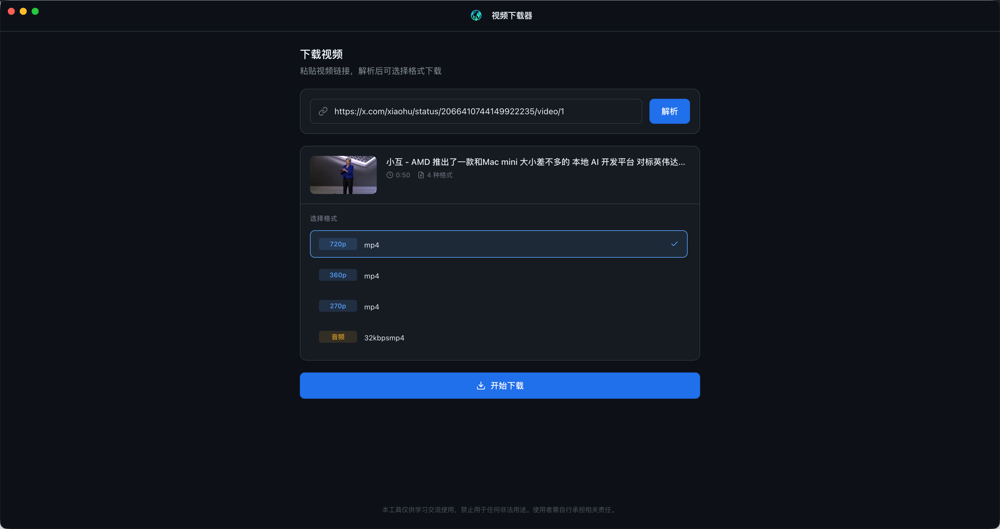

<p align="center">
	
</p>

<p align="center">
	<a href="LICENSE"></a>
	
	
	
</p>

<p align="center">
	<a href="https://github.com/Geekmister/OmniFetch/stargazers">
		
	</a>
	<a href="https://github.com/Geekmister/OmniFetch/network/members">
		
	</a>
	<a href="https://github.com/Geekmister/OmniFetch/issues">
		
	</a>
	<a href="https://github.com/Geekmister/OmniFetch/commits">
		
	</a>
	
	<a href="https://github.com/Geekmister/OmniFetch/releases">
		
	</a>
</p>

<p align="center">
	<a href="README.md">
		
	</a>
</p>

<p align="center">
	OmniFetch是一个通用视频下载器，基于 Electron、Vue 3 和 yt-dlp，支持 1000+ 网站（YouTube、X、B站、抖音等）。一键解析、格式选择、下载进度显示，开箱即用。
</p>

---



## 核心功能

| Emoji | 功能 | 描述 |
|---|---|---|
| 🚀 | 全站下载 | 基于 yt-dlp，支持 1000+ 视频站点 |
| 📥 | 一键解析 | 输入视频链接，自动读取可用格式 |
| 🎚️ | 格式选择 | 选择清晰度、音视频编码、容器 |
| ⏱️ | 进度展示 | 实时显示下载百分比、速度和 ETA |
| ⏸️ | 暂停/继续/取消 | 允许控制当前下载任务 |
| ⚙️ | 内置运行时 | 携带 `yt-dlp` 和 `ffmpeg` 二进制文件 |
| 🔒 | 安全 IPC | Electron `contextBridge` + 预加载层，保证渲染器安全 |

## 快速开始

1. 环境要求
   - Node.js >= 18
   - macOS / Windows / Linux

2. 安装依赖
   ```bash
   npm install
   ```

3. 下载运行时二进制
   ```bash
   npm run download:bins
   ```

4. 启动渲染器开发服务
   ```bash
   npm run dev
   ```

5. 启动 Electron 开发模式
   ```bash
   npm run electron:dev
   ```

6. 生成生产构建
   ```bash
   npm run build
   ```

7. 打包发布
   ```bash
   npm run electron:build
   ```

## 使用说明

1. 打开 OmniFetch。
2. 将视频链接粘贴到 URL 输入框。
3. 点击 **Parse** 解析视频信息和可选格式。
4. 从列表中选择下载格式。
5. 选择输出文件夹。
6. 点击 **Download** 开始下载。
7. 界面会显示实时进度、下载速度和剩余时间。
8. 需要时可点击 **Pause**、**Resume** 或 **Cancel**。

> 取消下载时，OmniFetch 会提示是否删除已下载的临时文件。

## 运行时二进制支持

OmniFetch 自带运行时二进制文件，存放于 `bin/`：

- `bin/yt-dlp`
- `bin/ffmpeg`

这些文件会在打包时作为额外资源一起包含。若从源码运行，请先执行 `npm run download:bins`，以确保本地运行环境可用。

Electron 主进程通过 `electron/bin-resolver.ts` 解析内置二进制文件，若本地环境没有匹配版本，则回退到系统 `PATH`。

## 项目结构

```text
OmniFetch/
├── bin/
│   ├── ffmpeg
│   └── yt-dlp
├── electron/
│   ├── bin-resolver.ts
│   ├── downloader.ts
│   ├── main.ts
│   ├── preload.cjs
│   └── ytdlp-updater.ts
├── python-script/
├── scripts/
│   └── download-bins.mjs
├── src/
│   ├── assets/
│   ├── components/
│   ├── stores/
│   ├── views/
│   ├── App.vue
│   └── main.ts
├── docs/
│   └── TechnicalSolution-v1.0.0(MVP).md
├── package.json
├── tsconfig.json
├── vite.config.ts
└── README.zh-CN.md
```

## 贡献指南

欢迎贡献！请遵循以下规范：

- 使用 Vue 3 和 `<script setup>` 语法。
- 保持组件职责单一。
- 为变量和函数使用清晰的英文命名。
- 提交前运行 `npm run build` 确认构建通过。
- 遇到问题时请先提交 issue，再提交 PR。

### 提交规范

请遵循 Conventional Commits：

- `feat`: 新功能
- `fix`: 修复 Bug
- `docs`: 文档修改
- `style`: 格式化修改，不影响逻辑
- `refactor`: 重构代码，不新增功能也不修复 Bug
- `chore`: 构建/维护任务

---

## 实时趋势面板

<p align="center">
	<a href="https://star-history.com/#Geekmister/OmniFetch&Date">
		
	</a>
</p>

<p align="center">
	
</p>

<p align="center">
	<a href="https://github.com/Geekmister/IPlay/graphs/contributors"></a>
</p>

---

## 许可证

基于 [MIT 许可证](LICENSE) 发布。
