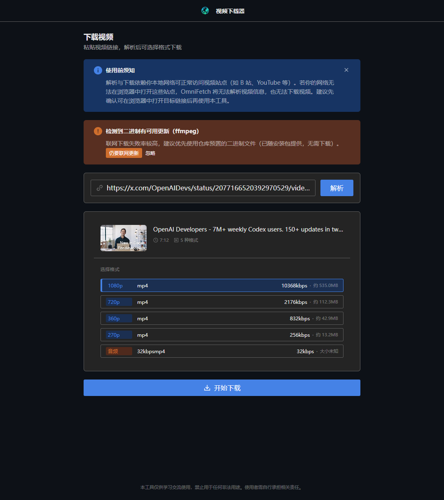

<p align="center">
	
</p>

<p align="center">
	<a href="LICENSE"></a>
	
	
	
</p>

<p align="center">
	<a href="https://github.com/Geekmister/OmniFetch/stargazers">
		
	</a>
	<a href="https://github.com/Geekmister/OmniFetch/network/members">
		
	</a>
	<a href="https://github.com/Geekmister/OmniFetch/issues">
		
	</a>
	<a href="https://github.com/Geekmister/OmniFetch/commits">
		
	</a>
	
	<a href="https://github.com/Geekmister/OmniFetch/releases">
		
	</a>
</p>

<p align="center">
	<a href="README.md">
		
	</a>
</p>

<p align="center">
	OmniFetch是一个通用视频下载器，基于 Electron、Vue 3 和 yt-dlp，支持 1000+ 网站（YouTube、X、B站、抖音等）。一键解析、格式选择、下载进度显示，开箱即用。
</p>

---



## 核心功能

| Emoji | 功能 | 描述 |
|---|---|---|
| 🚀 | 全站下载 | 基于 yt-dlp，支持 1000+ 视频站点 |
| 📥 | 一键解析 | 输入视频链接，自动读取可用格式 |
| 🎚️ | 格式选择 | 选择清晰度、音视频编码、容器 |
| ⏱️ | 进度展示 | 实时显示下载百分比、速度和 ETA |
| ⏸️ | 暂停/继续/取消 | 允许控制当前下载任务 |
| ⚙️ | 内置运行时 | 携带 `yt-dlp` 和 `ffmpeg` 二进制文件 |
| 🔒 | 安全 IPC | Electron `contextBridge` + 预加载层，保证渲染器安全 |

## 快速开始

1. 环境要求
   - Node.js >= 18
   - macOS / Windows / Linux

2. 安装依赖
   ```bash
   npm install
   ```

3. 下载运行时二进制

	> ⚠️ **注意**：二进制是平台相关的，**必须在目标平台执行 `npm run download:bins`** 以获取对应版本。跨平台直接拷贝会导致不兼容（如 macOS 的 Mach-O 二进制无法在 Windows 上运行）。

	> ⚠️ **注意**：若非有必须使用最新版本要求，不建议频繁联网更新二进制，因上游下载源不稳定，可能导致下载失败率较高。建议优先使用仓库预置的二进制文件。

   ```bash
   npm run download:bins
   ```

4. 启动渲染器开发服务
   ```bash
   npm run dev
   ```

5. 启动 Electron 开发模式
   ```bash
   npm run electron:dev
   ```

6. 生成生产构建
   ```bash
   npm run build
   ```

7. 打包发布
   ```bash
   npm run electron:build
   ```

## 使用说明

1. 打开 OmniFetch；
2. 将视频链接粘贴到 URL 输入框；
3. 点击 **解析** 解析视频信息和可选格式；
4. 从列表中选择下载格式；
5. 选择输出文件夹；
6. 点击 **下载** 开始下载；
7. 界面会显示实时进度、下载速度和剩余时间；
8. 需要时可点击 **暂停**、**恢复** 或 **取消**；

> 取消下载时，OmniFetch 会提示是否删除已下载的临时文件。

> ⚠️ **使用前须知**：解析与下载依赖你本地网络可正常访问视频站点（如 B 站、YouTube 等）。若你的网络无法在浏览器中打开这些站点，OmniFetch 将无法解析视频信息，也无法下载视频。建议先确认可在浏览器中打开目标链接后再使用本工具。

## 运行时二进制支持

OmniFetch 自带运行时二进制文件，按 **平台-架构** 分目录存放于 `bin/`：

- `bin/win32-x64/yt-dlp.exe` + `ffmpeg.exe`
- `bin/darwin-arm64/yt-dlp` + `ffmpeg`（Apple Silicon）
- `bin/darwin-x64/yt-dlp` + `ffmpeg`（Intel）
- `bin/linux-x64/yt-dlp` + `ffmpeg`

> ⚠️ 二进制是平台相关的，**必须在目标平台执行 `npm run download:bins`** 以获取对应版本。跨平台直接拷贝会导致不兼容（如 macOS 的 Mach-O 二进制无法在 Windows 上运行）。

这些文件会在打包时作为额外资源一起包含。若从源码运行，请先执行 `npm run download:bins`，以确保本地运行环境可用。

Electron 主进程通过 `electron/bin-resolver.ts` 解析内置二进制文件（含魔数校验，确保平台匹配），若本地环境没有匹配版本，则回退到系统 `PATH` 中的 `yt-dlp` / `ffmpeg`；若两者均缺失，应用会给出明确报错与修复指引（提示运行 `npm run download:bins`）。

#### 预置版本与自动更新

仓库随安装包**预置全部平台的二进制文件**，并通过 `bin/manifest.json` 记录各平台-架构的预置版本。应用启动时：

- 若当前平台-架构的预置二进制已是最新（与 `manifest.json` 一致），则**跳过联网更新**，直接使用预置文件；
- 若检测到上游有更新，会在界面顶部以警告提示用户，**并明确告知联网下载失败率较高、建议优先使用预置二进制**；是否联网更新由用户自行决定。

#### 各平台二进制下载链接

> 以下为 `npm run download:bins` 实际使用的 latest 下载源。手动预置时，请将文件按 `bin/<platform>-<arch>/` 目录存放，并把实际版本号填入 `bin/manifest.json`。

**yt-dlp**

| 平台-架构 | 下载链接 | 存放文件名 |
|----------|----------|------------|
| `win32-x64` | `https://github.com/yt-dlp/yt-dlp/releases/latest/download/yt-dlp.exe` | `bin/win32-x64/yt-dlp.exe` |
| `darwin-arm64` | `https://github.com/yt-dlp/yt-dlp/releases/latest/download/yt-dlp_macos` | `bin/darwin-arm64/yt-dlp` |
| `darwin-x64` | `https://github.com/yt-dlp/yt-dlp/releases/latest/download/yt-dlp_macos` | `bin/darwin-x64/yt-dlp` |
| `linux-x64` | `https://github.com/yt-dlp/yt-dlp/releases/latest/download/yt-dlp_linux` | `bin/linux-x64/yt-dlp` |

> 注：yt-dlp 的 macOS 版为通用二进制（universal），`darwin-arm64` 与 `darwin-x64` 共用同一链接。

#### 代理自动探测

OmniFetch 会自动探测代理，并通过 `--proxy` 参数传递给 yt-dlp，多数情况下无需手动配置。探测优先级如下：

1. **环境变量**（跨平台）：`HTTPS_PROXY` / `HTTP_PROXY` / `ALL_PROXY`（含小写变体）。
2. **Windows 系统代理**：读取 `Internet Settings` 注册表（`HKCU\Software\Microsoft\Windows\CurrentVersion\Internet Settings` 的 `ProxyEnable` / `ProxyServer`），支持「协议特定」（`http=...;https=...;socks=...`）与「单一地址」两种格式。
3. **macOS 系统代理**：通过 `scutil --proxy` 读取（HTTPS / HTTP）。
4. **Linux 系统代理**：优先读取 **GNOME** 的 `gsettings`（`org.gnome.system.proxy.{http,https,socks}`，仅 manual 模式），回退到 **KDE** 的 `kreadconfig5`（`proxysettings`）。

若未探测到代理，yt-dlp 将直连网络。对于境外/受限站点（如 `xhamster.desi`），请开启 VPN/代理，并确保其已写入系统代理或 `HTTPS_PROXY` 环境变量（如 `http://127.0.0.1:7890`），否则可能出现连接被重置（`curl: (35) Recv failure: Connection was reset`）。

**ffmpeg**

| 平台-架构 | 下载链接 | 提取目标 |
|----------|----------|----------|
| `win32-x64` | `https://github.com/BtbN/FFmpeg-Builds/releases/download/latest/ffmpeg-master-latest-win64-gpl.zip` | 解压取 `bin/ffmpeg.exe` → `bin/win32-x64/ffmpeg.exe` |
| `darwin-arm64` | `https://evermeet.cx/ffmpeg/ffmpeg-7.0.2.zip` | 解压取 `ffmpeg` → `bin/darwin-arm64/ffmpeg` |
| `darwin-x64` | `https://evermeet.cx/ffmpeg/ffmpeg-7.0.2.zip` | 解压取 `ffmpeg` → `bin/darwin-x64/ffmpeg` |
| `linux-x64` | `https://johnvansickle.com/ffmpeg/releases/ffmpeg-release-amd64-static.tar.xz` | 解压取 `ffmpeg-*-static/ffmpeg` → `bin/linux-x64/ffmpeg` |

> 注：Windows / Linux 的 ffmpeg 为压缩包，需解压后提取可执行文件；macOS 为裸二进制 zip。

#### 同步版本号到 manifest.json

将二进制文件放入 `bin/<platform>-<arch>/`（通过 `npm run download:bins` 或手动放置）后，运行以下命令可自动探测并把实际版本号写入 `bin/manifest.json`：

```bash
npm run sync:bin-versions
```

脚本会扫描每个 `bin/<platform>-<arch>/` 目录，分别执行 `yt-dlp --version` 与 `ffmpeg -version`，解析输出后将版本号回填到 `bin/manifest.json`（保留其他平台条目）。这样无需手动编辑即可保持预置版本记录准确。

## 项目结构

```text
OmniFetch/
├── bin/
│   ├── <platform>-<arch>/
│   │   ├── yt-dlp(.exe)
│   │   └── ffmpeg(.exe)
│   └── manifest.json
├── electron/
│   ├── bin-resolver.ts
│   ├── downloader.ts
│   ├── binary-updater.ts
│   ├── main/
│   │   └── index.ts
│   ├── preload/
│   │   └── index.ts
├── python-script/
├── scripts/
│   └── download-bins.mjs
├── src/
│   ├── assets/
│   ├── components/
│   ├── stores/
│   ├── views/
│   ├── App.vue
│   └── main.ts
├── docs/
│   └── TechnicalSolution-v1.0.0(MVP).md
├── package.json
├── tsconfig.json
├── electron.vite.config.ts
└── README.zh-CN.md
```

## 贡献指南

欢迎贡献！关于开发环境搭建、运行时二进制（Git LFS）管理、分支流程与提交规范，请阅读完整的 [CONTRIBUTING.md](CONTRIBUTING.md)。

---

## 实时趋势面板

<p align="center">
	<a href="https://star-history.com/#Geekmister/OmniFetch&Date">
		
	</a>
</p>

<p align="center">
	
</p>

<p align="center">
	<a href="https://github.com/Geekmister/IPlay/graphs/contributors"></a>
</p>

---

## 支持的站点

OmniFetch 依赖 yt-dlp 的提取器支持 1000+ 网站。完整支持站点列表见 [SupportedSites.zh-CN.md](SupportedSites.zh-CN.md)（中文）与 [SupportedSites.md](SupportedSites.md)（English）。

## 许可证

基于 [MIT 许可证](LICENSE) 发布。
